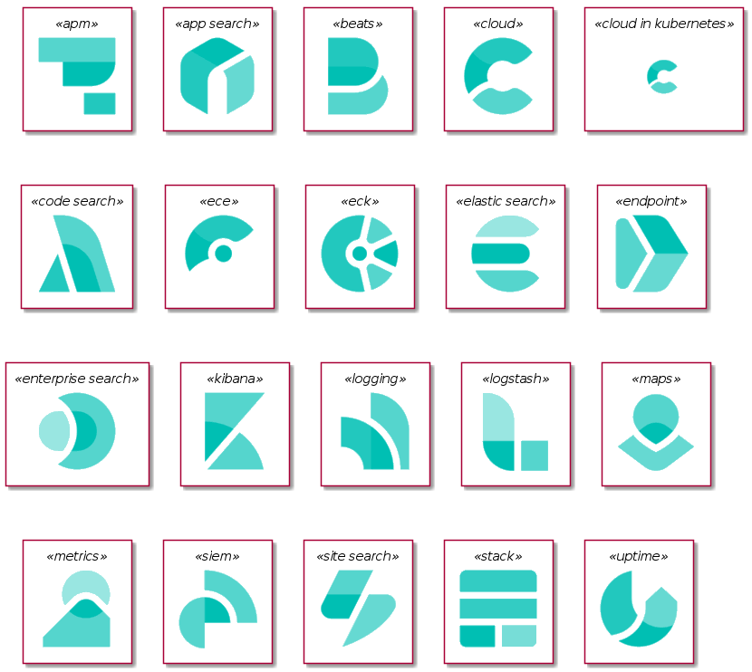

# PlantUML  Elastic Sprites
Sprites from [Elastic](https://www.elastic.co) for use with PlantUML:
1. here to share with kind permission from the nice guys at Elastic community team. Thanks to Max, David, Philipp for prompt feedback!
2. original logos in svg format from Elastic [here](https://www.elastic.co/brand). See the [Interesting Elastic story behind these icons](https://www.elastic.co/blog/redesigning-product-logos-and-icons-while-building-a-design-hierarchy-at-elastic).


# Using PlantUML Elastic Sprites

## Demo


PlantUML source extract that creates this diagram. 
See full source ./S3_ELK.puml

````
AMAZONS3(s3_bucket,"Logs uploaded to here")

KIBANA(Kibana, "Visualize") 
LOGSTASH(Logstash, "Parse and Transform")
ELASTIC_SEARCH(ElasticSearch, "Search and Analyze")

s3_bucket -down-> Logstash: Raw logs
Logstash -right-> ElasticSearch: Transformed Data
ElasticSearch -right-> Kibana: Data to View

````

## Full Sprite Set



PlantUML source extract that creates this diagram. 
See full source ./All.puml

````
skinparam componentBackgroundColor White 

APM(apm)
APP_SEARCH(app_search)
BEATS(beats)
CLOUD(cloud)
CLOUD_IN_KUBERNETES(cloud_in_kubernetes)
CODE_SEARCH(code_search)
ECE(ece)
ECK(eck)
ELASTIC_SEARCH(elastic_search)
ENDPOINT(endpoint)
ENTERPRISE_SEARCH(enterprise_search)
KIBANA(kibana)
LOGGING(logging)
LOGSTASH(logstash)
MAPS(maps)
METRICS(metrics)
SIEM(siem)
SITE_SEARCH(site_search)
STACK(stack)
UPTIME(uptime)

````


# Converting the icon set to PlantUML Sprites

```
# Need: Git, Python3, ImageMagick Convert

# Get the scripts that do the hard work
git clone git@github.com:Crashedmind/PlantUML-Elastic-icons.git

# Setup a temporary directory to work in
mkdir tmp
cd tmp/

# Download and unzip the svg icons from elastic.co
./get_elastic_logos.sh

# Convert the svg icons in color folder to 100x100 png in png folder
cd color
../../svg2png.sh
ls ./png/

# Convert the png icons to Plantuml sprites

## Get png to PlantUML conversion script
git clone git@github.com:milo-minderbinder/AWS-PlantUML.git
cd AWS-PlantUML

## Create PlantUML sprites from Elastic png icons
python3 puml.py -c ./puml.ini ../color/png/  #sprites output to ./dist/elastic/

# Move folder with created PlantUML Elastic sprites to top level
mv  ./dist/elastic ../../plantuml-elastic

```

# PlantUML Sprite Colors
Sprites are monochrome per https://plantuml.com/sprite.

Elastic icons are multi-color.

It's useful to identify Elastic sprites by color (versus e.g. AWS sprites) e.g.
* Elastic Green Background with Black Foreground
* Elastic Green Foreground with White Background

I opted for the latter as it looked better.

## Background Color
If desired, the background color can be changed e.g. so it's easier to see Elastic products versus AWS products in a diagram.

This can be done in the plantuml source file via
````
skinparam componentBackgroundColor #00BFB3
````
where "#00BFB3" is the green color used in the elastic svgs e.g.

logo-elastic-search-color-64.svg 
````
        <path d="M47.7246,44.293 L47.7276,44.299 C42.7746,50.227 35.3286,54.001 26.9996,54.001 C16.4006,54.001 7.2326,47.889 2.8136,39.001 L38.0056,39.001 C40.5306,39.001 42.9886,39.871 44.9206,41.497 C45.9246,42.342 46.8636,43.262 47.7246,44.293" id="Fill-6" fill="#00BFB3"></path>
````

## Foreground Color
Search and replace "black" with "00BFB3" in all puml files.
